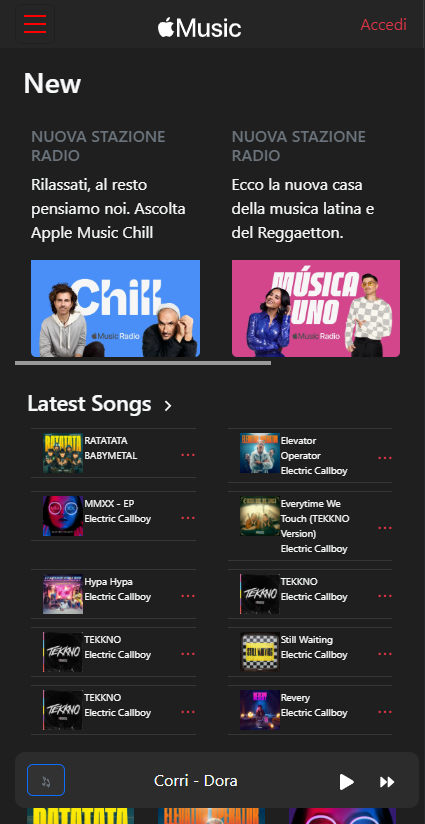
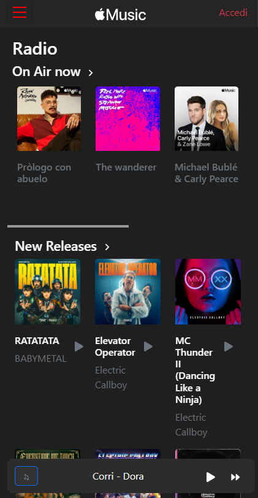
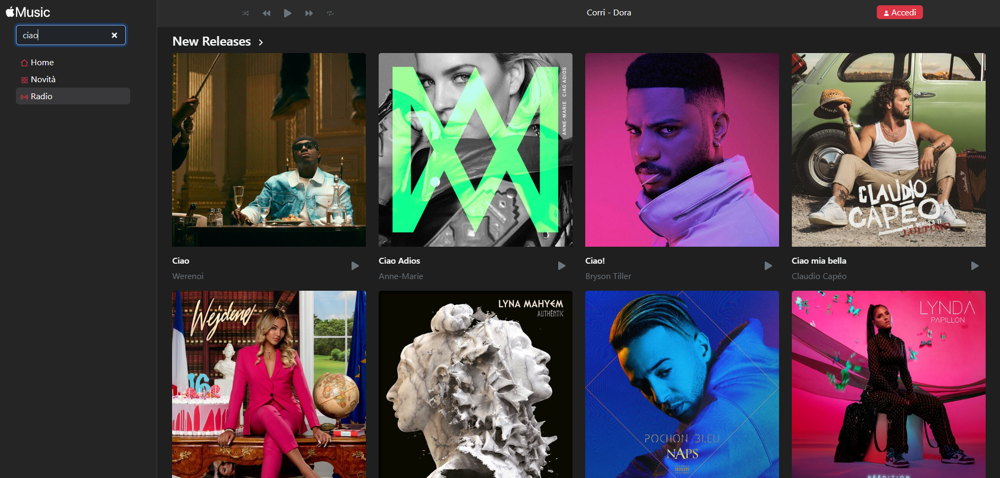

<!-- PROJECT LOGO -->
 

  <h3 align="center">Apple Music Clone</h3>

    
  

<!-- ABOUT THE PROJECT -->
## About The Project

 

# Weather App –  React JS 🏕️🌊

This project completed with React, was created during 3rd month(last Front-end project) of the 6-month full-stack course I attended in 2025:
A music app clone made using React, Javascript, Redux and Bootstrap.
I used the API **Deezer** to source music/artists data and songs previews.
The app allows you to look for artists/albums/songs and listen to song previews(just mind your ears as the volume cannot be regulated yet!!).

<!-- GETTING STARTED -->
## Demo

Check it out directly from here:

https://apple-music-clone-sepia.vercel.app/new

## 🌐 Website pages

The website is thus structured:
- **Home Page** 
- **New** 
- **Radio** 

---

## 🛠️ Tech used

- **Front-End:** HTML, CSS, Javascript, Redux, Bootstrap  
- **Testing/API:** Dezeer

---

(<a href="#readme-top">back to top</a>)

<!-- CONTACT -->
## Contacts

Vincenza Fumarulo - [LinkedIn](https://www.linkedin.com/in/vincenza-fumarulo/) - vinni2690@hotmail.com - [LinkGitHub](https://github.com/moonril/)

**Progect Link:**
- Frontend: [https://github.com/Moonril/W11-D5-project-Music-app](https://github.com/Moonril/W11-D5-project-Music-app)

(<a href="#readme-top">back to top</a>)

